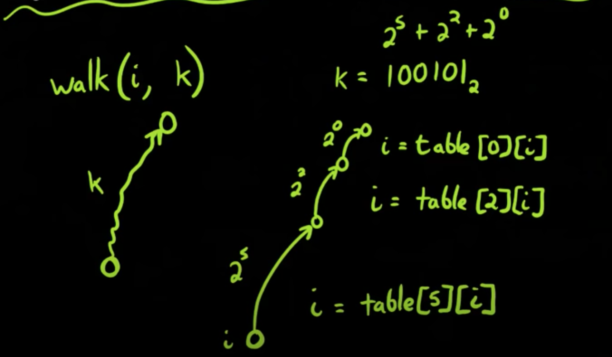

# Lowest Common Ancestor 
https://leetcode.com/problems/lowest-common-ancestor-of-a-binary-tree/

https://github.com/tr0j4n034/AlgorithmLibrary/blob/master/LCA%20with%20binary%20lifting.cpp

https://sukeesh.com/blog/2016-08-22/lca-binary-lifting

https://www.xspdf.com/resolution/10055211.html

## Binary lifting
- Jump 1 i.e. 2^0 up to tree
- Jump 2 i.e. 2^1 up to tree
- Jump 4 i.e. 2^2 up to tree
- Jump 2^k i.e. 2^k up to tree
    
- Idea is similar to `skip list`
- Make table of `2D` of size m *n where `m` is range of `k` and `n` is number of nodes.
    - 2^k <= n 
    - k <= log n
- Building table
    
    - table[k][i] = parent[i] if k == 0
    - table[k][i] = dp[dp[k][i-1]][i-1] of k > 0
    - 
- Define `walk(i,k)` function
    - `i` is current node
    - `k` edges is jump I want to do from node `i`
        - We can represent `k` in binary
        - k = 100101 = 2^5 + 2^2 + 2^0
        - I.e I can take jum of `5` then to `2` then to `0`
    - From node `i`, i = table[5][i]
        
- Define `lca(i,j)`
    - Get common ancestor for node `i` and `j`
    - Check the level of `i` and `j` and move up level for smaller level
    - walk(i,j) to be at same level
    - binary search for lca
        - Do binary search on jump as close to `lca`
        - From ans postion, just jump 1 will give the `lca`
- Sudo code for `dfs`
```
const dfs = (node, parent, table, m, n) => {
    // base case
    table[0][node] = parent;

    // Build table as per binary lifting
    for (let k=0; k < log; k++) {
        table[k][node] = table[k-1][table[k-1][node]]        
    }
    // process all childs/neighbors
    for (const child of tree[node]) {
        // calculate level of each node
        level[child] = lavel[node] + 1;
        dfs(child, node, table, m, n)
    }
}
```
- Suodo code for `lca`
```
const lca = (i, j) => {
    // The node which is present farthest from the root node, is taken as `i`, if `j` is farthest then swap
    // find ancestor of `i` which same level as `j`
    for (let k=log; k >=0; i--) [
        if((lev[i] - Math.pow(2, k)) >= leve[j]) {
            i = memo[k][i]
        }
    ]
}
```
# Kth Ancestor of a Tree Node
https://leetcode.com/problems/kth-ancestor-of-a-tree-node/
```
import "math";
type TreeAncestor struct {
    n int
    parents [][] int
    height int;
}

func Constructor(n int, parent []int) TreeAncestor {
    // initialize parents[i][j]: 2^j -th ancestor of node i
    parents := make([][]int, n);
    height := int(math.Ceil(math.Log2(float64(n))));
    for i:=0; i <n; i++ {
        parents[i] = make([]int, height);
        parents[i][0] = parent[i]; // initialize parent
    }
    
    // update parent relationship for rest
    for j:=1; j < height; j++ {
        for i:=0; i < n; i++ {
            // parents of level j - 1
            p := parents[i][j-1];

            // if parent is not root
            if (p != -1) {
                parents[i][j] = parents[p][j-1];
            } else {
                parents[i][j] = -1;
            }
        }
    }        
    return TreeAncestor {n: n, parents: parents, height: height};
}

func (this *TreeAncestor) GetKthAncestor(node int, k int) int {
    // binary lifting
    for j :=0; j < this.height; j++ {        
        if(k&1 == 1) {
            node = this.parents[node][j];
            if(node == -1) {
                return -1;
            }
        }
        k = k >> 1;
    }
    return node;
}


/**
 * Your TreeAncestor object will be instantiated and called as such:
 * obj := Constructor(n, parent);
 * param_1 := obj.GetKthAncestor(node,k);
 */
```
