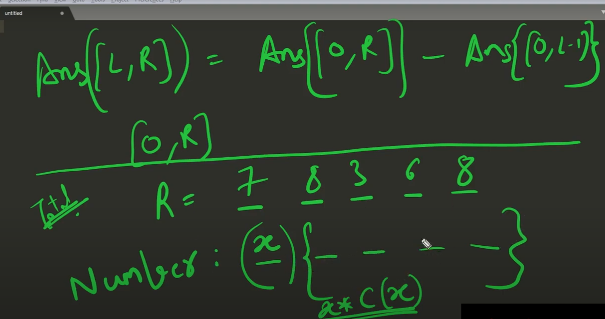

# Reference
https://www.youtube.com/watch?v=heUFId6Qd1A

https://www.youtube.com/watch?v=2yAEj-0A8bk


https://www.youtube.com/watch?v=sCwokuCoQB8

# Summary
- Another type of DP
# Count of integers
- Find count of integers `x` so that `0<x<r` which obey function f(x)
- Find count of integers `x` so that `l<x<r` which obey function f(x)
## Bruteforce approach
- This can be solve by trying all possible value of x
## DP
- s(r) = count of numbers from 0 to r which obey f(x)
- s(l-1) = count of numbers from 0 to l-1 which obey f(x)
- Soln of problem 2 become s(r) - s(l-1)
# Sample Problem 
- Find the count of numbers between L and R which have a sum of digits = `x`
- `f(i)`: sum of digits of number `i` is `x`
## Brute force
```
const bruteForce = (l, r, x) => {
    let ans = 0;
    for (let i=l; i < r +1; i++) {
        if(check(i, x)) {
            ans++;
        }
    }
    return ans;
}
const check = (i, x) => {
    let sum = 0;
    while(i) {
        sum += i % 10;
        i /= 10;
    }
    return sum === x;
}
```
## Using DP
- Let's say `R` is `87692`
- Let's solve upper limit of `R` as `99999`
- Lower limit of `R` is `00000`
- Following is all numbers
    - 00000
    - 00001
    - 00002
    - 00003
    - .....
    - .....
    - 99999
- Now problem can be reworded as below
    - For given `5` digits number, find out count of number which has digits sum as `x`
    - Problem is now coverted to fill 0-9 digits on given 5 available positions
    ```
    - - - - - 
    ```
    - dp(n,x): count of numbers has n digits which has sum of digits as x
    - Let's say if i fill `0` at first place
    ```
    0
    - - - - - 
    ```
    dp(n,x) = dp(n-1, x)
    - If we put `1` at first place
    ```
    1
    - - - - -     
    ```
    dp(n,x) = dp(n-1, x-1)
    - similarly we can put `2`, `3`, `4`, ... `9`
    - Recurrance formula for `dp`
    dp(n,x) = dp(n-1, x) + dp(n-1, x-1) + dp(n-1, x-2) + ... + dp(n-1, x-9)
    - For given `R`, `n` is number of digits
        - log(R) with base 10
    - Time complexity: O(log(R) * x * 10)
    - Constraints on filling digits
        - input R = 5 2 7 3
        ```
        - - - - 
        ```
        - At first position, it should only be 0, 1, 2, 3, 4, 5
        - If first position is `5` then second should be 0, 1
        - Similarly, If first position is `5` and second is `2` then third should be 0, 1, ....7
    - Let's write DP relationship
        - For example R = 5 2 1 3
        - dp(N, X, 1): Number of digits N with condition x and place digit on place `0`. Here `1` represent boolean variable
        - dp(N, X, 1) = sum(
           dp(N-1, X, 0), // put 0 at the first
           dp(N-1, X-1, 0), // put 1 at the first
           dp(N-1, X-2, 0), // put 2 at the first
           dp(N-1, X-3, 0), // put 3 at the first
           dp(N-1, X-4, 0), // put 4 at the first
           dp(N-1, X-5, 1), // put 5 at the first 
        )
Following is code in DP
```
const recursion = (num, n, x, tight, dp) => {
    // base case 1: if x is < 0
    if(x < 0) {
        return 0;
    }
    // base case 2: single len num
    if(n === 1) {
        if(x >=0 && x <= 9) {
            return 1;
        }
        return 0;
    }
    if(dp[num][n][tight] !== -1) {
        return dp[num][n][tight];
    }
    const ub = tight ? (num[num.length - n].charCodeAt(0) - '0'.charCodeAt(0)): 9;
    let ans = 0;
    for (let dig = 0; dig <= ub; dig++) {
        ans += recursion(num, n - 1, x - dig, tight & (dig == ub), dp)
    }
    dp[num][n][tight] = ans;
    return ans;
}
const solve = (R, x) => {
    const n = R.length;
    const dp = new Array(n+1).fill(0)
                .map(a => new Array(x+1).fill(0))
                .map(b => new Array(2).fill(-1));
    return recursion(R, R.length, x, 1, dp)
}
const test = () => {
    const R = '15'
    const x = 5;
    return solve(R, x);
}
```
# Boaring Numbers
https://codingcompetitions.withgoogle.com/kickstart/round/000000000019ff49/000000000043b0c6#problem
- a positive number is called boring if all of the digits at even positions in the number are even and all of the digits at odd positions are odd.
- The digits are enumerated from left to right starting from 1
- For example
    - the number 1478 is boring 
    - as the odd positions include the digits {1, 7} which are odd 
    - and even positions include the digits {4, 8} which are even.
- Given two numbers L and R, count how many numbers in the range [L, R] (L and R inclusive) are boring
## DP
- dp(i): count of number with i digits which are boaring number
- dp(N): N is 0 to 99999....99999
- Need to fill positions
```
- - - - - - - 
```
- Following are constraints
    - Fill odd digits on odd position
    - Fill even digits on even position
    - How to find out position is even/odd?
    - Number not starting with `0`
    - `12345`, here index of position can tell odd/even
    - `01234`, here index + 1 will tell odd/even
    - I.e. need to consider if put leading `0`
- DP definition
    ```
    dp(N, even, leading, tight): Number of boaring number from 0 to N 
    ```
- Filliing
    ```
    x
    - - - - - - - 
    ```
- Code
    Refer digit-dynamic-programming/boarding-numbers.js
# Digit Sum
https://www.youtube.com/watch?v=H6OCV7qcZoQ&t=1413s
https://www.spoj.com/problems/PR003004/
- For a pair of integers L and R
- The digit sum of the interval [L,R] is defined as 
- the sum of all digits occurring in all numbers between (and including) a and b. 
- For example, the digit sum of [28, 31] can be calculated as:
    - 2+8  +  2+9  +  3+0  +  3+1 = 28
# DP
- Filling position for R = 78368
```
- - - - -
```
- Define dp

    - dp(N, tight): sum of sum of all digits of N digits  number <=R
    - dp(N,1):  0*c(0) + dp(N-1, 0) 
        + 1*c(1) + dp(N-1, 0)
        + 2*c(2) + dp(N-1, 0)
        + 3*c(3) + dp(N-1, 0)
        .....................
        + (ub-1)*c(ub-1) + dp(N-1, 0)
        + ub*c(ub) + dp(N-1, 1)
    - c(x) is total numbers can be formed by placing x on nth position

# Problmes

https://www.spoj.com/problems/CPCRC1C/

https://www.spoj.com/problems/GONE/

https://www.spoj.com/problems/RAONE/

https://www.spoj.com/problems/LUCIFER/

https://leetcode.com/problems/number-of-digit-one/


https://leetcode.com/problems/count-numbers-with-unique-digits/

# Others

https://leetcode.com/problems/rotated-digits/

https://leetcode.com/problems/numbers-at-most-n-given-digit-set/

https://leetcode.com/problems/find-all-good-strings/

https://leetcode.com/problems/numbers-with-repeated-digits/


https://leetcode.com/problems/non-negative-integers-without-consecutive-ones/

