# Reference
https://www.youtube.com/watch?v=c5O7E_PDO4U

https://www.youtube.com/watch?v=EKcQt-74bNw&t=549s

https://www.youtube.com/watch?v=uUatD9AudXo

# Sparse Table
## Sparse Table Intitution
- Every positive integer can easily be represented as a sum of power of `2` given by its binary representation
- 19 = (10011)2 = 2^4 + 2^1 + 2^0
- Similarly, any interval [l,r] can be broken down smaller interval power 2
- [5, 17] = [5, 5 + 2^3) +  [13, 13 + 2^2] + (17, 17 + 2^0)
        = [4, 13) + [13, 17) + [17, 18)
- diff = 17 - 5 = 12
- Get one higher len = 13
- 13 in binary = 1101 = 2^3 + 2 ^2 + 2^0
- Now, imagine if we could precompute the range query answer (i.e. max, min, lcm)
## Range Combination function
### Associative functions
- A function `f(x,y)` is associative if 
    f(a, f(b,c)) = f(f(a,b),c) for all a, b, c
- Following operations are associative
    - Addition
    - Multiplication
- Following operations are not associative
    - Subtraction
    - exponentiations
- Sparse table can answer associative range query in O(log n)
### Can we do better than O(log n)
- When the range query combination function is `overlap friendly`, then range query on sparse table can be answered in `O(1)`
- Being overalp friendly means a function yields the same answer regardless of whether it is combining ranges which overlap or those that do not
- We say a binary function `f(x,y)` is overlap friendly if 
    f(f(a,b), f(b,c)) = f(a, f(b,c)) for all valid a, b, c
- Following function is not overlap friendly
    f(x,y) = x + y
- Following are overlap functions
    - max
    - min
    - gcd
    - lcm
## Table construction
- `N` is size of the input
- `2^P` be the largest power of `2` that fits in the length of the value array
- 2^P <= N
- P <= logN
- P = floor(logN)
- N = 13
    - P = floor(log 13)
    - P = 3
- Initialize table with `P + 1` rows and `N` columns
- Fill first rows with input values
- Each cell (i, j) represents the answer for the range [j, j + 2^i) in the original array
- Any range which is outsize of input array will be kept empty that will make table sparsed
### Min sparsed table
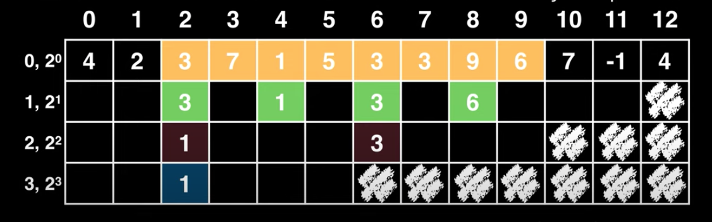
- f(x,y) = min (x,y)
- will build table by already computed prev range value
- Each cell (i, j) represents the min answer for the range [j, j + 2^i) in the original array
- Length of range for each cell is always even
- It means we can easily split range into two
- dp[i][j] = f(dp[i-1][j], dp[i-1][j + 2^(i-1)]) 
           = min(dp[i-1][j], dp[i-1][j + 2^(i-1)]) 

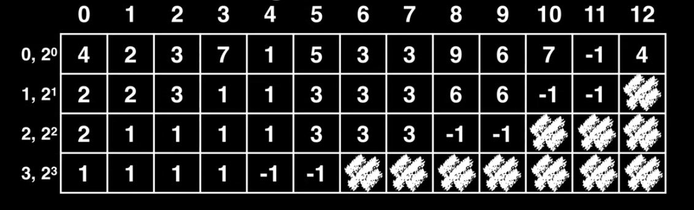
## Range Query
- What is minimum value between [1, 11)?
    - In our table, we have already pre-computed the answer for all intervals of length 2^k
    - k is the largest power of two that fits in the length of range between `[l,r)`
    - Split range `[l,r)` as below
        - left interval: `[l, l +k]`
        - right interval: `[r - k + 1, r`
    - left and right interval may overlap but this doesn't matter given the operlapping property
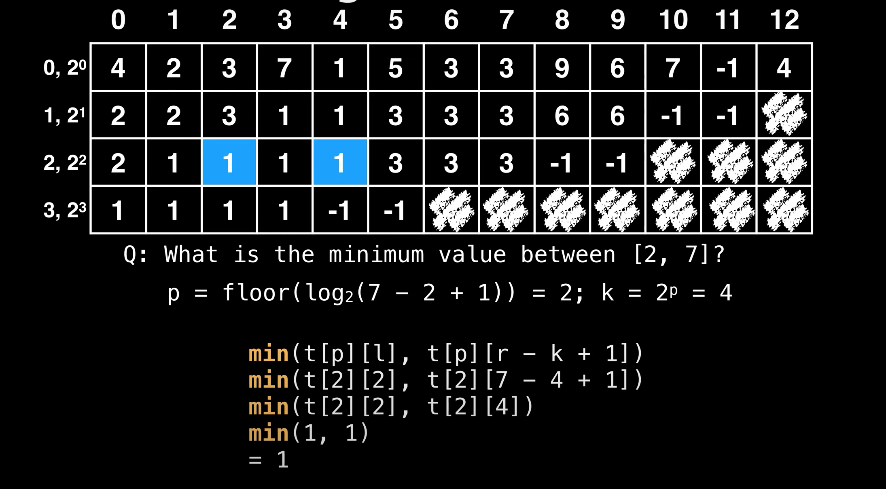
## Associative Function Query
- Do casecading query on the sparse table by breaking the range `[l,r)` into smaller range of `2^x` which do not overlap.
- For example, range `[2,15]` i.e. `15 -2 = 13 ~ 14 = 1110` can be split into three intervals of lengths 
    - 8
    - 4
    - 2
    - [2, 2 + 2^3] + [10, 10 + 2^2] + [14, 14 + 2^1]
### Product function
- Construct Sparse table
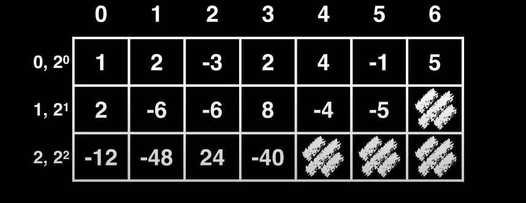
- Product between range `[0,6]
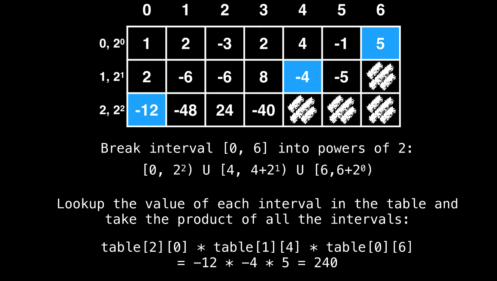
- Product between range `[1,5]`
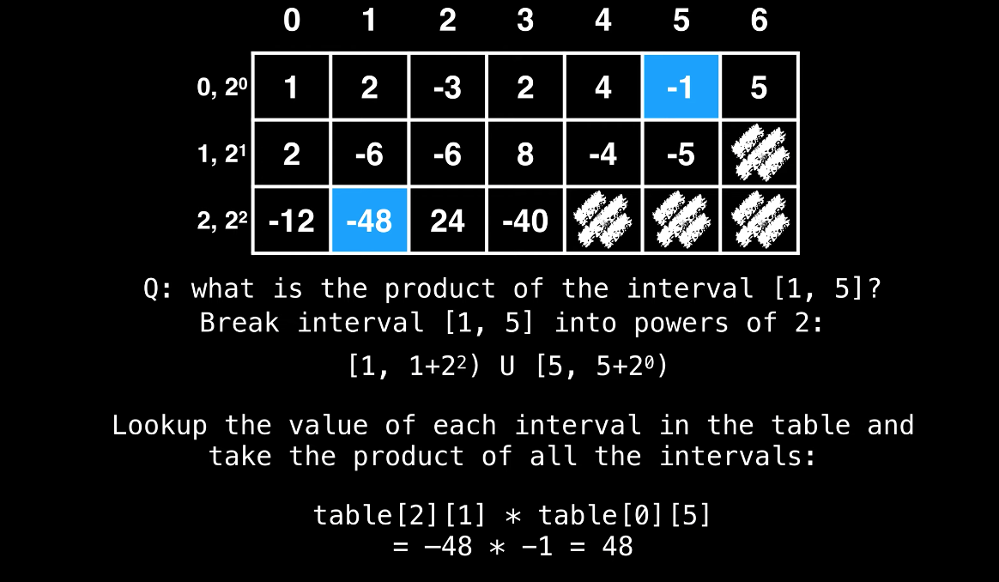
## Sparse table psuedocode
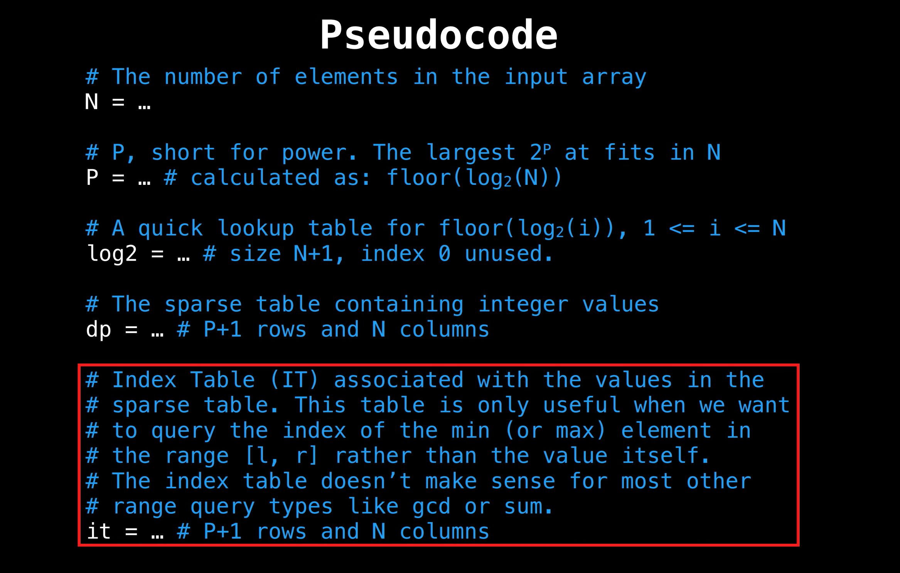
## Sparse table construction code
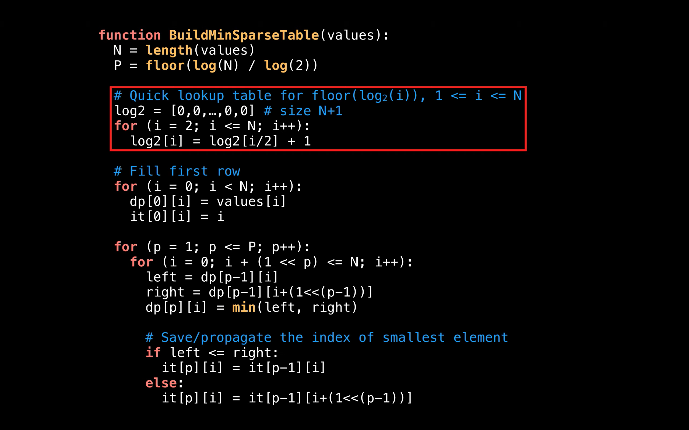
## Sparse table range query
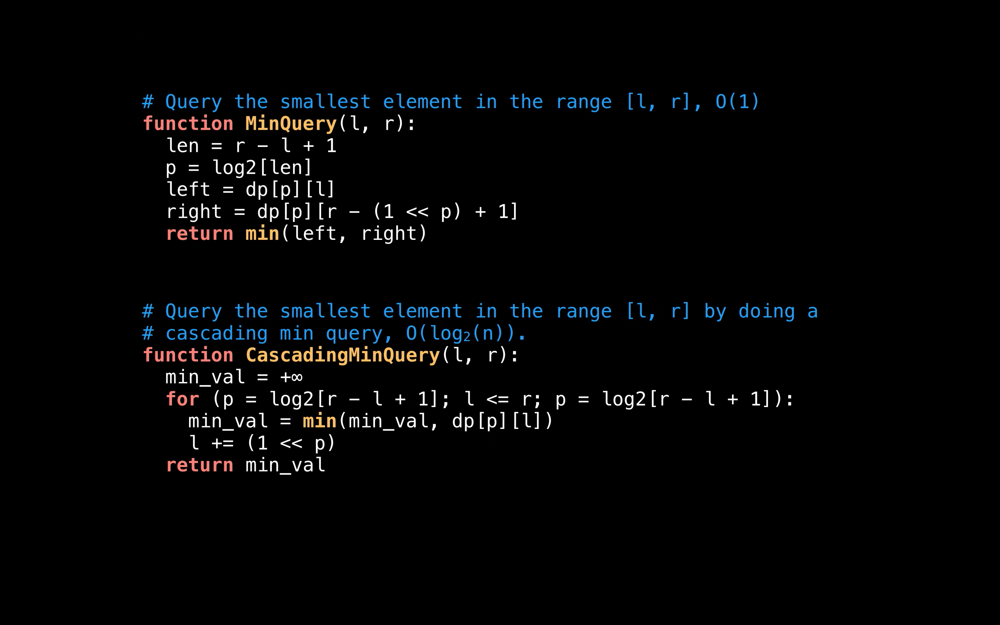
## Sparse table to return index
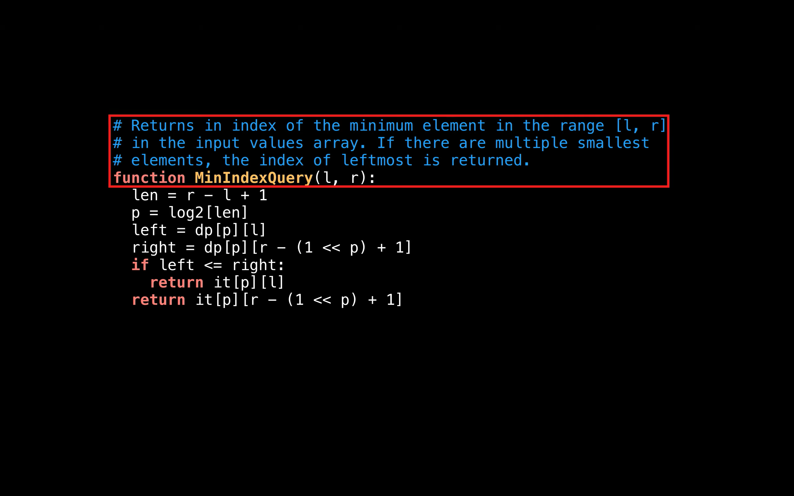
# Sparse Tables and LCA
## Euler Tour of a Tree
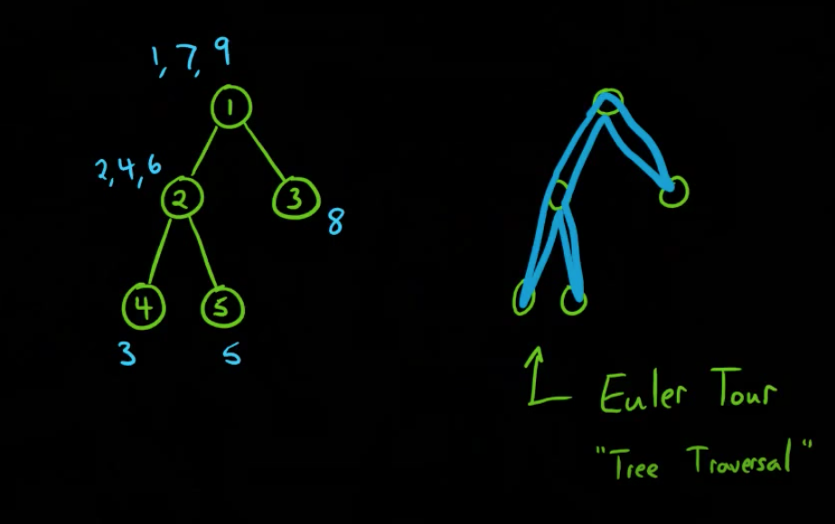
- Translate tree to array for run query easier
- This is technically not a Euler tour
- This is basically a tree traversal
- We repeat the edge 
- Apply timer everytime you touch node
- We take tree and convert into sequence
- This is called Euler tour tree
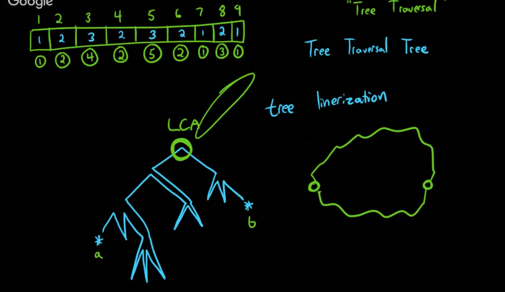
- Create array of size timer
- Map timer to corresponding node
- Also maintain height of each node
- This is `Tree linearization`
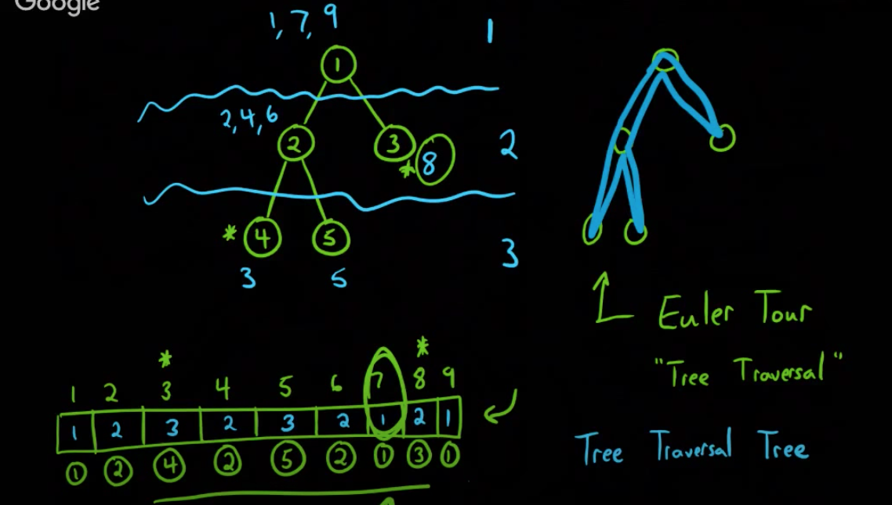
- Range minimum between two given nodes gives `lca`
    - Use `Segment Tree` to run Range minimum query
    - You can also apply `Sparse Table` to get range minimum query
## Sparse Table 
- Used to run range minimum query 
- This is similar to binary uplifting
- For given index `i`, keep track of following
    - What is minimum 1 away  i.e. same position
    - What is minimum 2 away
    - What is minimum 4 away
    - What is minimum 8 away
    ........................
    ........................
    - What is minimum 2^k away
- Sparse table can be defined as below
    - table[k][i] = min [i, i + 2^k)
    - table[k][i] = min(table[k-1][i], table[k-1][i+ 2^(k-1)] )
    - Use bit shift operator
    - Query time complexity is O(1)
    - Get the diff between two nodes positions
    - Get every length power of 2
- You can use Sparse table query for following
    - min
    - max
    - gcd
    - lcm

#  Kth Ancestor of a Tree Node
https://leetcode.com/problems/kth-ancestor-of-a-tree-node/

# Maximum Binary Tree
https://leetcode.com/problems/maximum-binary-tree/

# Find a Value of a Mysterious Function Closest to Target
https://leetcode.com/problems/find-a-value-of-a-mysterious-function-closest-to-target/

# Sliding Window Maximum
https://leetcode.com/problems/sliding-window-maximum/

# XOR Queries of a Subarray
https://leetcode.com/problems/xor-queries-of-a-subarray/

